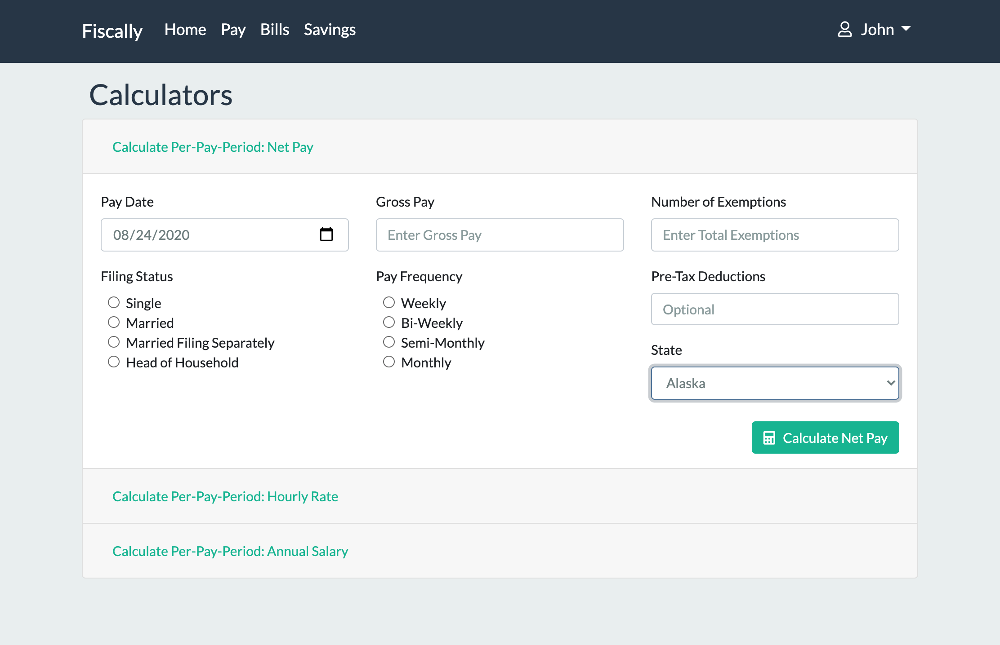

# Fiscally

Fiscally is a personal finance web application that makes being fiscally responsible simple and easy. It helps users to track their savings, bills, and it can even calculate net pay from a simple pay calculator.

Check it out for yourself here: [Fiscally](https://fiscally.herokuapp.com/)

**Landing Page:**


**Home Page:**


## Features

### Calculate Pay

<p style="text-align: center"><b>Net Pay Calculator</b></p>



Fiscally has a few different pay calculators that would suit nearly every user need.

The first pay calculator that a user would encounter would be the _Net Pay_ calculator. This calculator takes various pay variables such as a user's filing status, pay frequency, exemptions, and gross pay. Once a user clicks the _Calculate_ button, it generates a paystub that will be appeneded to its own _Paystubs_ section. Calculations are sourced from the [Taxee API](https://taxee.io/).

<p style="text-align: center"><b>Paystubs</b></p>


Additionally, a user can calculate their gross pay on a per-pay-period basis, whether they're a salaried or an hourly employee, using their respective gross pay calculator.

<p style="text-align: center"><b>Hourly Calculator</b></p>


<p style="text-align: center"><b>Salary Calculator</b></p>


---

### Track Bills

Fiscally provides a simple way for a user to add and track their monthly bills. All a user has to do is fill out a form with their bill information and it will be added to a table. A user can edit and delete a bill, or even mark a bill as paid. All bill amounts will be totaled and displayed for a user to know exactly how much money they need to shell out for the month!

<p style="text-align: center"><b>Bills Tracker</b></p>


### Track Savings

Fiscally's last feature, but certainly not the least, is the savings tracker. A user can add savings entries and watch their savings grow! In emergencies, a user can even withdraw from their savings, which would be reflected as a deduction.

<p style="text-align: center"><b>Savings Activity Table</b></p>


If a user wants to save up to buy something expensive, or even save up a downpayment for a home, they can add a savings goal. Once a goal is added, a user can track how much they've already saved and the number of days until their goal's deadline.

<p style="text-align: center"><b>Savings Goal Tracker</b></p>


## Tech Stack

Fiscally was proudly built using the following programming languages, libraries, and APIs:

-   Python
    -   Flask
    -   Flask-Login
    -   Flask-Bcrypt
    -   Flask-Migrate
    -   Flask-WTF
    -   Flask-SQLAlchemy
-   Jinja HTML Templates
-   JavaScript
-   APIs
    -   Authlib
        -   Used to allow for users to Signup and Login using Google
    -   Twilio's Sendgrid
        -   Used to send users email from Fiscally
    -   Taxee API
        -   Used to calculate net pay via applying Federal and State taxes

## API Usage

All APIs used require a developer to create an account in order to receive an API Key. These API keys are either shown in the code examples below as environment variables or they're abstracted within Fiscally's `config.py` file.

### Authlib

Authlib was used in Fiscally to implement Google Signup and Login.

<p style="text-align: center"><b>Google OAuth Configuration</b></p>

```
CONF_URL = 'https://accounts.google.com/.well-known/openid-configuration'

google = oauth.register(
    name='google',
    server_metadata_url=CONF_URL,

    # The scope defines what data from a user's google account you want to retrieve
    client_kwargs={
        'scope': 'openid email profile'
    }
)
```

<p style="text-align: center"><b>Google OAuth Endpoint Implementation</b></p>

```
@auth_bp.route('/google/login')
def google_login():
    """ Show google login page """

    redirect_uri = url_for('auth.google_authorize', _external=True)
    return google.authorize_redirect(redirect_uri)


@auth_bp.route('/google/authorize')
def google_authorize():
    """ Handle user creation and login with google account """

    # Get Google OAuth's authorization token
    token = google.authorize_access_token()

    # Get user's Google account data by parsing auth token
    g_data = google.parse_id_token(token)

    # If user doesn't exists, create, login user and reirect to profile, else login user and redirect.
    user = User.query.filter_by(email=g_data['email']).first()

    if user is None:
        user = User.register(
            g_data['given_name'], g_data['family_name'], g_data['email'], g_data['sub'])
        db.session.add(user)
        db.session.commit()

        # Flask-Login function to login a user
        login_user(user)

        send_email(user.email, 'Welcome to Fiscally!',
                   render_template('welcome_email.jinja', user=user))

        return redirect(url_for('user.user_profile'))

    # Flask-Login function to login a user
    login_user(user)
    return redirect(url_for('user.user_profile'))
```

### Twilio's Sendrid API

Twilio's Sendgrid API was used to make sending emails to users a quick and painless process. The following is the API logic abstracted into a function for global application usage:

<p style="text-align: center"><b>Send Email Function</b></p>

```
from os import environ
from sendgrid import SendGridAPIClient
from sendgrid.helpers.mail import Mail


def send_email(recipient_email, email_subject, content):
    """ Sends an email to all recipients """

    message = Mail(
        from_email='fiscally.email@gmail.com',
        to_emails=recipient_email,
        subject=email_subject,
        html_content=content
    )

    sg = SendGridAPIClient(environ.get('SENDGRID_API_KEY'))
    response = sg.send(message)
```

### Taxee API

The Taxee API contains years of Federal-level and State-level income tax data. It was used to power Fiscally's Net Pay calculator. Take note that the API's `Content-Type` request header is a URL encoded form and the response will be a JSON string.

The following code shows how Fiscally retrieved and parsed data from the Taxee API:

<p style="text-align: center"><b>Taxee API Implementaion</b></p>

```
# Preparing request headers and request post data
headers = {
    'Authorization': environ.get('TAXEE_API_SECRET'),
    'Content-Type': 'application/x-www-form-urlencoded',
}

data = {
    'pay_rate': form.gross_pay.data,
    'filing_status': form.filing_status.data,
    'state': form.state.data,
    'pay_periods': form.pay_frequency.data,
    'exemptions': form.exemptions.data
}

response = requests.post(
    'https://taxee.io/api/v2/calculate/2020', headers=headers, data=data)

tax_data = response.json()
```

## Contributing

Pull requests are welcome. For major changes, please open an issue first to discuss what you would like to change.

## License

[MIT](./LICENSE.txt)
